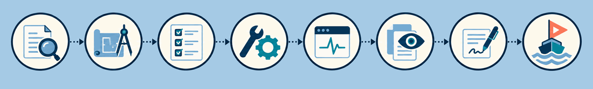

<p align="center"></p>

# shipyard

shipyard is a set of ten agent skills that take a code change from question to pull request in eight stages, with a `ship` skill that tells you which stage your branch is at and what comes next. It is for developers who use a coding agent and want each step of a change (plan, tests, live check, review, PR description) done the same way every time.

What you get:

- A router, `ship`, that reads your branch and names the next stage.
- A skill for each stage that has one, each ending with a `next:` line that names the stage after it.
- A `pr-review` that checks every finding against the diff and has a second agent validate it.
- Per-project settings files, so each skill follows your team's conventions.

The skills use the open [Agent Skills](https://agentskills.io) format (a folder with a `SKILL.md`). They are built and evaluated in Claude Code. In Codex, installing the skills and agents and having Codex find them is tested; running the stages end to end there isn't yet.

## Quick start

### Claude Code

```sh
claude plugin marketplace add lokeshrana9999/claude-skills-pack
claude plugin install delivery@shipyard
```

The first command adds this repo as a marketplace named `shipyard`. The second installs the `delivery` plugin at user scope (add `-s project` to it for one project): the ten skills, four [helper agents](docs/helper-agents.md) that `pr-review` and `build-workflow` start as subagents, and the `signal` output style (answer first, one next step), which you pick in Claude Code's settings. Update with `claude plugin update delivery@shipyard`; remove with `claude plugin uninstall delivery@shipyard`.

### Codex, Gemini CLI, Cursor, GitHub Copilot, OpenCode, and others

From your project root, with Node.js installed:

```sh
npx skills add lokeshrana9999/claude-skills-pack --skill '*' --agent codex -y
```

Replace `codex` with your agent (`cursor`, `gemini-cli`, ...). This uses the [skills CLI](https://github.com/vercel-labs/skills) to copy all ten skills into `.agents/skills/`. Add `-g` to install for all your projects (into `~/.agents/skills/`) instead of one. Tested with `--agent codex -g`: all ten skills installed, and Codex listed them.

Then paste the short snippet from [docs/agents-install.md](docs/agents-install.md#3-paste-the-agentsmd-snippet) into your project's `AGENTS.md` (`GEMINI.md` for Gemini CLI). It gives the agent the stage order and tells it not to start `pr-review`, `pr-description`, or `build-workflow` unless you ask, which Claude Code enforces on its own and other agents don't. The same page covers updating, the optional helper agents, and a manual copy without the CLI.

### First run

On the branch you're working on, run `/delivery:ship` in Claude Code, or say "ship this" in another agent. On a branch that adds a rate limiter and its tests to a small library, and ticks the only entry in its plan file `PLAN.md`, it prints:

```
Stage: 3 implement — src/rate-limit.ts and its tests in the diff; PLAN.md's one entry ticked
Skipped: 4 verify live (a library, no app to boot)
next: 5 review — /delivery:pr-review
Then: 6 describe, 7 demo
```

It then asks before starting the next stage, or, for a stage only you can start, prints the command to run. An annotated run is in [examples/ship-transcript.md](examples/ship-transcript.md). To see open pull requests, `ship` needs your code host's CLI (such as `gh`) installed and signed in; without it, it reports "PR: unknown".

## How it works

<p align="center"></p>


A rectangle is a stage you or the agent can start; a pill is one only you can start, by running its skill by name. Stage names are not skill names: explain runs `walkthrough`, describe runs `pr-description`, plan and implement happen in your agent's normal session (with `prisma-workflow` when a Prisma schema changes), and demo has no skill yet.

`ship` only routes. It reads the branch with cheap read-only checks (changed files, tests, a plan file, an open pull request), runs no builds or tests, and reports the current stage, any skipped ones, and the next one. `/delivery:ship all` instead prints a `/delivery:build-workflow` command for you to run, which runs the remaining stages as one multi-agent run. When demo comes next, `ship` says it has no skill yet and stops.

The stage-to-skill table, the routing rules, each skill's handoff, and how `pr-review` works are in [docs/pipeline.md](docs/pipeline.md).

## Skills

| Skill | Stage | What it does | Who starts it |
|---|---|---|---|
| `ship` | any | Places the branch in the pipeline and names the next stage | you or the agent |
| `walkthrough` | 0 explain | Writes explanations and documents answer-first, with one next action | you or the agent |
| `design-tests` | 2 test design | Writes a test-design document from the spec and the real code; writes no test code | you or the agent |
| `prisma-workflow` | 3 implement, when a Prisma schema changes | Makes a Prisma schema change with CLI-generated migrations, reviewed before they're applied | you or the agent |
| `live-verify` | 4 verify live | Boots the app, drives the changed flow over HTTP or in a browser, and reports each check with evidence | you or the agent |
| `pr-review` | 5 review | Reviews a branch against the project's recurring review concerns; `/delivery:pr-review mine` builds that list from past review comments | you only |
| `pr-description` | 6 describe | Drafts the PR title and body, shows it for approval, then creates or updates the PR | you only |
| `build-workflow` | several at once | Runs several stages as one multi-agent run, with capped fix loops and a separate verifier | you only |
| `flow-diagram` | any | Draws flowcharts, sequence, and state diagrams in the syntax the destination renders | you or the agent |
| `skill-auditor` | any | Audits `SKILL.md` files and writes a scored report with fixes | you or the agent |

"You only" means the skill sets `disable-model-invocation`, so Claude Code won't start it on its own; run it as `/delivery:<skill>`. In other agents, ask for it by name ("run pr-review against main"); Codex also takes `$<skill>` and Cursor `/<skill>`. Arguments for each skill are in [docs/skills/](docs/skills/README.md).

## Configuration

Each skill reads an optional settings file at `.claude/shipyard/<skill>.md` in your project root, and its values win over the skill's defaults. The path is the same in every agent, not only Claude Code. The fields each file accepts are listed on the skill's page in [docs/skills/](docs/skills/README.md), and [examples/nestjs-prisma/.claude/shipyard/](examples/nestjs-prisma/.claude/shipyard/) holds a worked set to copy and edit.

## Documentation

| Page | Read it when |
|---|---|
| [docs/pipeline.md](docs/pipeline.md) | you want the stages, how `ship` routes, each handoff, or how `pr-review` works |
| [docs/agents-install.md](docs/agents-install.md) | you install in an agent other than Claude Code |
| [docs/agents.md](docs/helper-agents.md) | you want to know what the four helper agents do |
| [docs/skills/](docs/skills/README.md) | you need one skill's arguments, settings, or handoff |
| [docs/evals.md](docs/evals.md) | you change a skill and need to run or write its evals |

## Contributing and license

[CONTRIBUTING.md](CONTRIBUTING.md) has the repo layout and the rules for changing a skill; [CHANGELOG.md](CHANGELOG.md) lists what changed between versions.

MIT, see [LICENSE](LICENSE). The eval fixtures under `plugins/delivery/evals/pr-review-bench/` include diffs from other projects under their own licenses, listed in [its README](plugins/delivery/evals/pr-review-bench/README.md#license-and-attribution).
