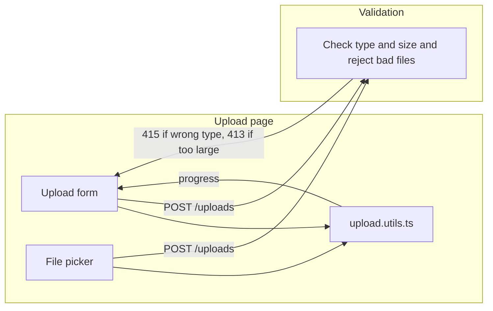
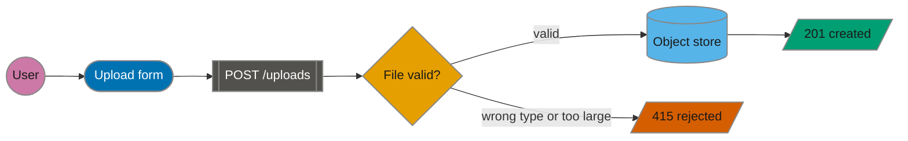
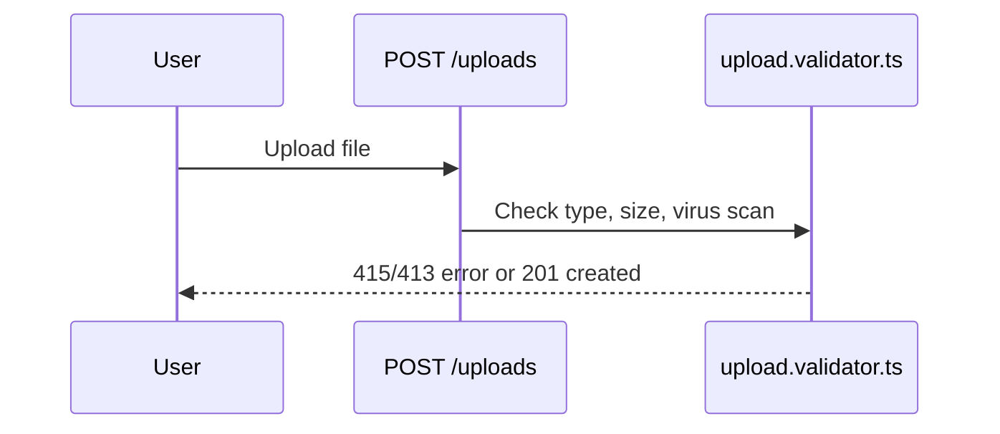
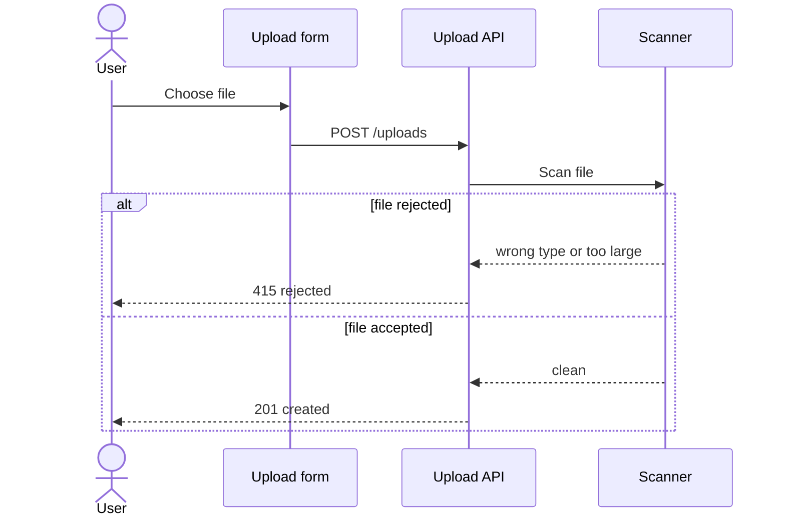

# Worked examples

Contents: flowchart before and after · sequence diagram before and after

One scenario runs through both pairs: a user uploads a file, and the server checks it before storing it. Copy the technique (role shapes, classes, one direction, a visible gate), not these boxes. The "before" versions are deliberately wrong.

## Flowchart

### Before: wrong

What's wrong:

1. Every node is a plain rectangle, so the form, the utility module, and the check look alike and the reader has to read every label.
2. No classes, so nothing draws the eye to the check, which is the point of the diagram.
3. `POST /uploads` sits on two identical edges, and a sentence rides on the reject edge.
4. Two back-edges (`415 …` and `progress`) turn an `LR` flow into a tangle.
5. The `Validation` subgraph wraps a single node, and `Upload page` mixes UI with a code module.
6. A filename (`upload.utils.ts`) stands in for a role.
7. The accept path isn't drawn at all, so the branch is invisible.

### After

Legend: circle = user, pill = UI, double bars = API, diamond = check, cylinder = store, parallelogram = outcome.

What changed: each role has its shape and class, the check is an orange diamond with two labelled exits, the outcomes differ in label as well as color, the HTTP route is a node instead of an edge label, and there are no back-edges or filenames.

## Sequence diagram

### Before: wrong

What's wrong: `POST /uploads` is a request, not a system, and `upload.validator.ts` is a filename. One message crams three checks together. Worst, the accept-or-reject fork is flattened into a single "error or created" return, so the decision isn't a branch at all.

### After

What changed: participants are systems, the HTTP route is a message, and the fork is an `alt` block showing both outcomes.
